# Last-Mile Delivery Tracker — Architecture Documentation

## System Architecture Diagram

```mermaid
flowchart TB
    subgraph Users["Platform Actors"]
        Customer["Customer Portal<br/>(Order Creation, Live Tracking, Reschedule)"]
        Agent["Delivery Agent Portal<br/>(GPS Broadcaster, Dispatch Actions, Failure Notes)"]
        Admin["Admin Operations Hub<br/>(Fleet Dispatch, Rates, Zones, Audits)"]
    end

    subgraph Frontend["Frontend Layer (Next.js 14 / App Router / Tailwind CSS)"]
        Pages["App Routes (/dashboard, /orders/new, /orders/[id]/tracking, /agent, /admin)"]
        SocketHook["Socket.IO Client Realtime Listener"]
        APIClient["Axios REST Interceptors"]
    end

    subgraph Gateway["API Gateway & Real-time Layer (Express.js / Node.js)"]
        AuthMiddleware["JWT & RBAC Middleware"]
        SocketServer["Socket.IO Server (Rooms: order:id, admin:channel)"]
        RateLimiter["Express Rate Limiting & Helmet"]
    end

    subgraph CoreServices["Domain Services Layer"]
        PricingService["Pricing Engine<br/>- Volumetric Wt (LxBxH/5000)<br/>- Max(Actual, Volumetric)<br/>- Dynamic Slab Lookup<br/>- COD Policy Calculation"]
        ZoneService["Zone Detection<br/>- Pincode → Area → Zone<br/>- Intra vs Inter Zone"]
        AssignmentService["Auto-Assignment Engine<br/>- Haversine GPS Distance<br/>- Capacity & Availability<br/>- Atomic Reservation Lock"]
        TrackingService["Tracking & Lifecycle<br/>- Append-Only Event Log<br/>- Enforced State Machine<br/>- Real-time Broadcast"]
        NotificationService["Multi-Channel Notification<br/>- Email & SMS Provider<br/>- Resilient Mock Fallback"]
        AuditService["Audit Log Service<br/>- Immutable Admin Actions"]
    end

    subgraph Database["Data Layer (MongoDB + Mongoose)"]
        UsersDB[("Users & DeliveryAgents")]
        ZonesDB[("Zones & Areas")]
        RatesDB[("RateCards & CODConfig")]
        OrdersDB[("Orders & Reschedules")]
        TrackingDB[("TrackingEvents (Append-Only)")]
        AuditDB[("AuditLogs")]
    end

    Users <--> Frontend
    Frontend <-->|REST API + WebSocket| Gateway
    Gateway <--> CoreServices
    CoreServices <--> Database
```

## Key Engineering Highlights
1. **Mathematical Pricing Engine**: Implements standard volumetric division \((L \times B \times H / 5000)\), evaluates chargeable weight against actual weight, matches active multi-slab rate cards, and computes bounded COD policies.
2. **Deterministic Auto-Assignment**: Uses the Haversine formula to compute great-circle geographic distance between delivery agent GPS coordinates and pickup locations, combining workload capacity checks with atomic MongoDB updates.
3. **Strict State Machine**: Enforces valid status progressions and rejects illegal lifecycle jumps.
4. **Append-Only Tracking**: Historical timeline events are strictly immutable; every state update or admin override produces a distinct chronological audit record.
